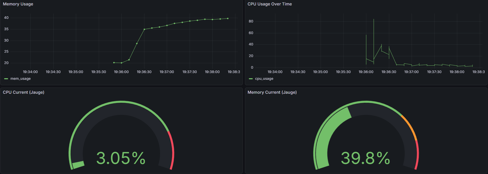

# Stack TIG Docker

**Projet stack TIG (Telegraf, InfluxDB et Grafana) avec Docker Compose**


## Étape 1: Docker-compose

### Docker-compose

```docker
# Compose uniquement InfluxDB
docker compose up -d influxdb3-core

# Générer token
docker-compose exec influxdb3-core influxdb3 create token --admin
# Modifier le .env avec le token admin

# Compose les autres services
docker compose up -d
```

### Grafana

#### Connecter une Data Source

* Se connecter à `http://localhost:3000`
* Ajouter une data source InfluxDB:
  * Name: InfluxDB
  * Query Language: SQL
  * URL: [http://influxdb3-core:8181](http://influxdb3-core:8181)
  * InfluxDB Details: projetTricaBucket, mettre le token généré avant, autoriser les "Insecure Connection"

#### Créer un Dashboard

4 visualisation

```SQL
/* Memory usage over time*/
SELECT time, used_percent as mem_usage FROM mem WHERE time > now() - INTERVAL '1 hours' ORDER BY time DESC

/* CPU Usage over Time */
SELECT time, 100.0 - usage_idle as cpu_usage FROM cpu WHERE time > now() - INTERVAL '1 hours' ORDER BY time DESC

/* CPU Current (Jauge) */
SELECT 100.0 - usage_idle as cpu_usage FROM cpu WHERE cpu = 'cpu-total' ORDER BY time DESC LIMIT 1

/* Memory Current (Jauge) */
SELECT used_percent as mem_usage FROM mem ORDER BY time DESC LIMIT 1
```

### Tester

#### Tester Telegraf

```Docker
# Tester que Telegraf reçoive bien des données
docker-compose exec telegraf telegraf -config /etc/telegraf/telegraf.conf -test
```

#### Tester InfluxDB

```docker
# Tester que InfluxDB reçoive les données de Telegraf
docker-compose exec influxdb3-core influxdb3 query "SHOW TABLES" --database projetTricaBucket --token RemplacerParTokenGenerer
```

#### Tester Grafana

```Docker
docker-compose exec grafana
# Acceder à http://localhost:3000
```
